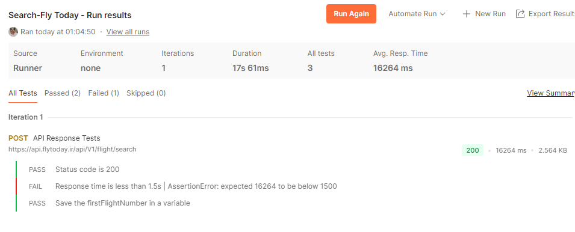
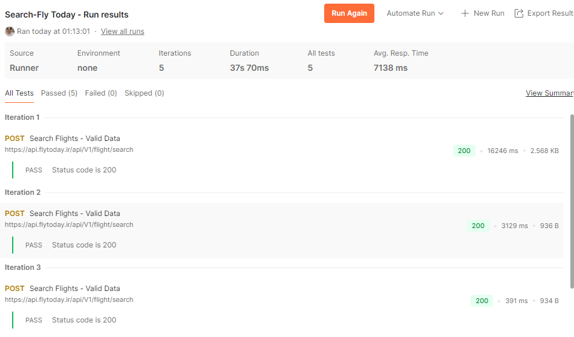
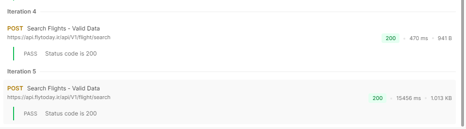

# 🧪 FlyToday Domestic Flight Search API Test – Postman

This project includes an API test collection developed in Postman for testing the domestic flight search on [FlyToday](https://www.flytoday.ir/).

## ✅ Test Scenarios:

1. Send GET request to search for domestic flights
2. Assert:
   - Response status code is 200
   - Response time is less than 1.5 seconds
   - Save first flight number to environment variable
3. Run the collection using **Collection Runner** with test data
4. Test with 5 different origin/destination combinations using CSV data file

## 📂 Files Included:
- `FlyToday-FlightSearch-Collection.postman_collection.json`: The Postman collection
- `flight-data.csv`: Data file for iteration
- `Postman Environment`: The file `ENV For Saving Flight Num.postman_environment.json` is a Postman environment used to store variables such as the flight number extracted from the first search result.  
- `README.md`: Project description

## 🛠 Technologies:
- Postman
- Postman Test Scripts (JavaScript)
- Collection Runner
- Data-driven testing (CSV)
  
## 📸 Postman Test Results

